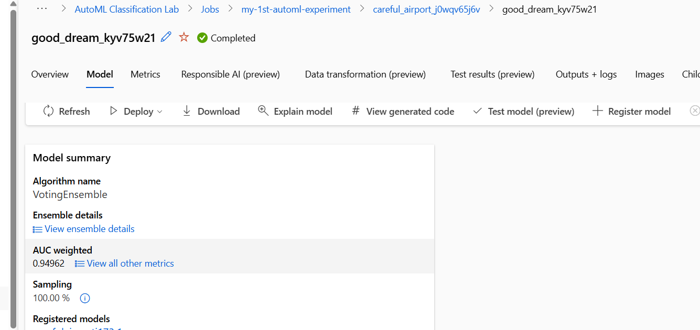
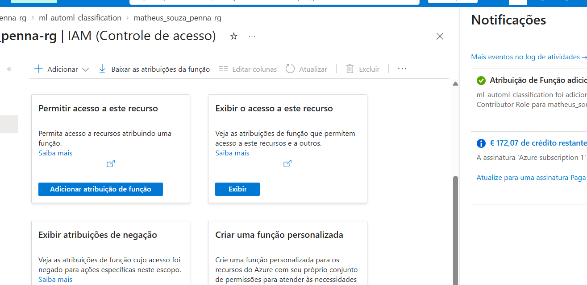
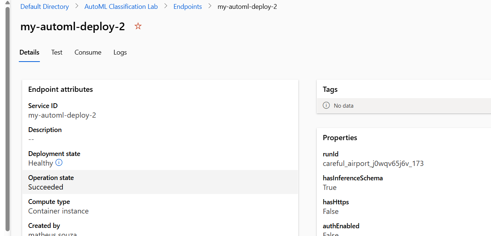

# Azure AutoML — Bank Marketing Classification

Projeto desenvolvido durante o bootcamp **Randstad - Análise de Dados**, da DIO, com o objetivo de aplicar conceitos de Machine Learning utilizando o **Azure Machine Learning** e o **Automated ML (AutoML)**.

## 🎯 Objetivo

Construir um experimento de classificação utilizando o **Bank Marketing Dataset**, passando pelas etapas de preparação dos dados, treinamento automatizado, comparação de modelos, análise das métricas e deployment do modelo.

O problema consiste em prever se um cliente irá ou não contratar um depósito a prazo com base nas informações disponíveis no conjunto de dados.

## 📊 Dataset

Foi utilizado o arquivo:

`bank-additional-full.csv`

O conjunto de dados contém informações relacionadas a campanhas de marketing bancário, incluindo características dos clientes e informações de contato.

Durante a configuração do experimento no Azure Machine Learning, os dados foram registrados como um **Data Asset** para utilização pelo AutoML.

## 🤖 Treinamento com AutoML

O experimento foi configurado como um problema de **classificação**.

O Azure Automated ML treinou e comparou diferentes pipelines e algoritmos automaticamente.

O melhor resultado encontrado foi:

| Métrica | Resultado |
|---|---|
| Melhor modelo | VotingEnsemble |
| AUC weighted | 0.94962 |

O VotingEnsemble combina as previsões de diferentes modelos treinados durante o experimento.

> **Observação:** AUC weighted é uma métrica de avaliação do modelo e não deve ser interpretada como 94,962% de acurácia.

## 🔎 Explicabilidade

Também foi executada a etapa de **Model Explanation** no Azure Machine Learning.

O processo de explicabilidade foi concluído com sucesso, permitindo analisar a importância das variáveis utilizadas pelo modelo.

## 🚀 Deployment

Após o treinamento, o modelo foi registrado no Azure Machine Learning e iniciei o deployment utilizando **Azure Container Instances (ACI)**.

Na primeira tentativa, o deployment falhou por falta de autorização para executar:

`Microsoft.ContainerInstance/containerGroups/write`

Isso levou a uma etapa adicional de troubleshooting.

## 🔐 Troubleshooting: Managed Identity e RBAC

Ao investigar o erro, identifiquei que a operação estava sendo realizada pela **System Assigned Managed Identity** do workspace do Azure Machine Learning.

A identidade não possuía a permissão necessária para criar o Container Group utilizado pelo deployment.

A correção foi realizada através do **Azure RBAC (Role-Based Access Control)**, atribuindo à Managed Identity do workspace a função:

`Azure Container Instances Contributor Role`

Após a atualização das permissões, realizei novamente o deployment sem precisar treinar o modelo outra vez.

## ✅ Resultado

O segundo deployment foi concluído com sucesso:

- **Deployment state:** Healthy
- **Operation state:** Succeeded
- **Compute:** Azure Container Instance
- **Modelo:** VotingEnsemble
- **Interface de inferência:** REST endpoint

O deployment utilizado neste laboratório foi baseado na API v1. Por isso, o Azure Machine Learning Studio atual não disponibilizou o teste diretamente pela interface, indicando a utilização de CLI, SDK ou REST API para realizar a chamada.

## 🧠 Principais aprendizados

Durante este projeto pratiquei conceitos relacionados a:

- Machine Learning supervisionado e classificação
- Azure Machine Learning
- Automated ML
- Comparação e avaliação de modelos
- Voting Ensemble
- AUC
- Model Explainability
- Registro e deployment de modelos
- Azure Container Instances
- REST endpoints
- Managed Identities
- Azure RBAC
- Troubleshooting de permissões no Azure

Além do treinamento do modelo, o problema encontrado durante o deployment permitiu compreender melhor como **Machine Learning, infraestrutura e controle de acesso** se relacionam na disponibilização de uma solução.

## 🛠️ Tecnologias

`Azure` `Azure Machine Learning` `AutoML` `Machine Learning` `Azure Container Instances` `RBAC` `REST API`

## 📚 Contexto

Projeto desenvolvido como parte dos estudos do bootcamp **Randstad - Análise de Dados**, na plataforma DIO.

O laboratório foi baseado no tutorial de classificação com Automated ML disponibilizado pela Microsoft Learn e no Bank Marketing Dataset.
